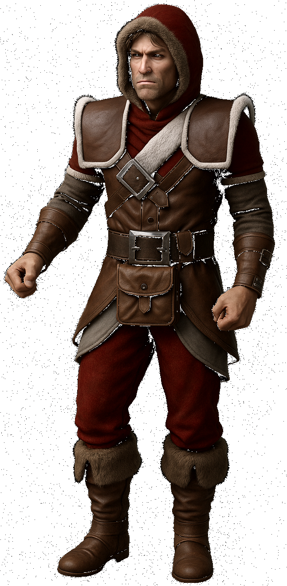

# Project-IE-4k
Project Infinity Engine 4K - Allows extracting, upscaling, and assembling from all game assets to a new override-X4 directory for use in GemRB.

## Description
The purpose of this project is to have native 2k/4k playable IE game assets and an engine capable of playing at those resolutions. The current focus is on the GemRB game engine and getting that capable of running these upscaled assets. The main focus of this repository will initially focus on creating a tool chain that allows people to create the assets and run them in game.  Currently we have basic AI upscaling, but new methods and workflows coming soon.

## Community
You can join our discord community at - https://discord.gg/Pr7wapQ5H6

## Current Status
Currently the project supports all file types that have image data and related files that have coordinate data that also needs to be updated in conjunction with the image data.  The BCS support is currently lacking and still needs more work to work properly.  BAM and PLT color configuration is also slightly off and needs some fine tuning I haven't been able to get working right yet.  Another portion of this project I think requires improvements and slight modifications to the GemRB engine.  To make the experience better GemRB needs zoom in and out support.  It also needs some changes to support an UpScaleFactor.  Things like movement speed, projectile speed, and size of some overlays like the circle around the player will need to be increased by the UpScaleFactor.

## Usage
Everything in the project focuses on allowing you to upscale your game assets.  For the first release the easiest way to get going is to clone this repository and build it yourself, but builds should be out soon.  All the commands should be viewable from the binary. You can run ./install/bin/pie4k and it should show you available commands.  It will never make changes directly to your game override directory.  All assets will be created in the "output" directory.  We will create a new override directory like demo-override-X4 or demo-override-X2.   The commands for converting each file type can be run individually or as part of batch operations.  You can also run the enitre operation from start to finish with ./install/bin/pie4k batch complete -c demo-reference.cfg for example.  Upscaling the entire GemRB demo is much faster than the real games and is a good test to see if everything is working.  On my system to complete all operations it takes about 3 hours on BG2.  Once you complete the operations you can run gemrb -c demo-x4.cfg, if you haven't installed gemrb yet you can run ./scripts/gemrb/install.sh, of course you can also just install it in other ways that GemRB supports.  Keep in mind you need to use my fork for now at https://github.com/Goddard/gemrb/tree/pie4k

## Supported Platforms
### Operating System
 - Linux - SUPPORTED - My primary development operating system so has had the most usage currently
 - Windows - SUPPORTED - I have a windows drive and got it built and working on Windows.  Resource usage is slightly more forgiving for VRAM since Windows supports SVM, but in my limited testing Windows did perform slower.
 - MacOS NOT SUPPORTED - I don't have a mac.  I don't think it would take too much to get it working, but I just haven't tested yet.

### Hardware Support
GPU - Nvidia is currently the only supported GPU.  Other GPUs will be supported soon.  I tested on a 4090 with 24 GB of VRAM, but it should still work if you have less VRAM available it will just take longer.

CPU - More cores more speed, but any CPU should still funciton.  The tasks the project does requires ample CPU power though.  I don't recommend trying to perform pie4k operations on a system without a GPU, but it is technically still possible, but it will probably take several days to complete if not weeks.

RAM - All testing has been done with 32 GB of RAM and SWAP space at 32 GB.

## Install
Download binaries on github page from releases section

## Build 
When you build this project you are really building 3 projects currently.  We obviously are building pie4k(project ie 4k), but also GemRB with our modifications included and NCNN.

### Linux
Whatever package manager you use, you will need gcc, cmake, git, libvorbis, sdl2, sdl2_mixer, sdl2_image, gtest, libvlc, vulkan headers, ninja 

If you have an Nvidia GPU you will need cuda with nvml.

`./compile.sh`

### Windows
I use msys2 to build on Windows.  You should use mingw-w64 and install these packages

`pacman -S --needed \
  mingw-w64-x86_64-gcc \
  mingw-w64-x86_64-cmake \
  mingw-w64-x86_64-extra-cmake-modules \
  git \
  make \ 
  mingw-w64-x86_64-freetype \
  mingw-w64-x86_64-SDL2 \
  mingw-w64-x86_64-openal \
  mingw-w64-x86_64-SDL2_mixer \
  mingw-w64-x86_64-libogg \ 
  mingw-w64-x86_64-libvorbis \
  mingw-w64-x86_64-libpng \ 
  mingw-w64-x86_64-gtest
  mingw-w64-x86_64-vlc \
  mingw-w64-x86_64-vulkan-headers \
  ninja`

You also need to have cuda installed if you have an Nvidia GPU.  Support for other GPUs are coming soon.

`./compile.sh`

## Roadmap
    Rules System
      - Add a rule system that allows more finer grained control on how resources are processed.
    Python Support
      - Add the ability for people to create python scripts that perform additional operations.
    Resume Operations
      - Resume 80% - Need the ability to resume and also make modifications selectively, but still allow a complete batch operation
    Mass Convert - PIE4k
      - MOS  100% - Extract,Upscale,Assemble
      - BAM  100% - Extract,Upscale,Assemble
      - TIS   90% - Extract,Upscale,Assemble - while everything works it could still be optimized for improved utilization.
      - ARE  100% - Extract,Upscale,Assemble
      - BCS   50% - Extract,Upscale,Assemble - currently supports all operations, but it is hamfisted and not done properly.
      - BMP  100% - Extract,Upscale,Assemble
      - CHU  100% - Extract,Upscale,Assemble
      - KEY   10% - add/remove - This is not really well tested and I don't recommend using it right now.
      - PLT  100% - Extract,Upscale,Assemble
      - PNG  100% - Extract,Upscale,Assemble
      - PVRZ 100% - File format is more of a child secondary to other file types so no direct operations
      - WED  100% - Extract,Upscale,Assemble
    GemRB - Modify GemRB allowing upscaled assets to run properly
      - 50% - Use UpScaleFactor for actors, projectiles, and ovarlays that are specific to engine and not files.
      - 85% - Add Zoom In/Out - mostly working with 4k assets, but has some issues when zoomed in for normal assets.
    Plugin System
      - All file types supported "plugins" currently and most fit the mold with some secondary "plugins" that kinda don't yet.
    Services System
      - All services currently mostly fit a mold I've created, but they are intended to be used to either add additional context or support for new AI systems.  For example upscaling is mostly simply handled by an NCNN service.  Some of the logic could be abstracted further than it is now to make it more generalized and easier for others to do something similar without as much work, but the structure exists now.  Planning support for other models and operations.
    Multi-GPU Support
      - Currently only 1 GPU is supported, planning on adding support for multiple.
    Configuration Expansion
      - Configuration options are currently limited.  Need more options for how things are handled such as alpha channels, colors, etc..

## GemRB Zoom & UpScaleFactor modifications
So Zoom is mostly functional along with UpScaleFactor, but some issues remain for both and fully playing the games without issue is likely not possible although it is close and if you are willing please test and report issues.

## Concepts
I think the potential for this tool is eventually something like the concept art below.  In the future I imagine we will be able to create more detailed art work, or even a completely altered style for the whole game, for example an "anime" style like shown in some of the models below.  It all depends on what the user wants really.  Here is a human theif model concept for example that I personally would love to see in a more ultra realistic style.

## Screenshots Per Model

  
  
upscayl-ultrasharp

  
  
upscayl-ultramix_balanced

  
  
upscayl-standard-4x

  
  
RealESRGAN_General_x4_v3

  
  
RealESRGAN_General_WDN_x4_v3

  
  
realesr-animevideov3-x4

  
  
upscayl-realesrgan-x4plus

  
  
upscayl-realesrgan-x4plus-v3

  
  
upscayl-realesrgan-x4-general-wdn-v3

  
  
4x_NMKD-Siax_200k

  
  
4x_NMKD-Superscale-SP_178000_G

  
  
4xHFA2k

  
  
4xLSDIR

  
  
4xLSDIRCompactC3

  
  
4xLSDIRplusC

  
  
4xNomos8kSC

  
  
digital-art-4x

  
  
high-fidelity-4x

  
  
realesr-animevideov3-x2

  
  
realesr-animevideov3-x3

  
  
remacri-4x

  
  
ultramix-balanced-4x

  
  
ultrasharp-4x

  
  
uniscale_restore

  
  
unknown-2.0.1

  
  
upscayl-hfa2k

  
  
upscayl-lite-4x

  
  
upscayl-lsdir-4x-compact-c3

  
  
upscayl-lsdir-4x-plus-c

  
  
upscayl-lsdir

  
  
upscayl-nmkd-4x-siax-200k

  
  
upscayl-nmkd-4x-superscale-sd-178000-g

  
  
upscayl-nomos-4x-8k-sc

  
  
upscayl-realesrgan-x4plus-anime

  
  
upscayl-remacri

  
  
upscayl-uniscale-restore

  
  
xintao-realesr-animevideo-x2-v3

  
  
xintao-realesr-animevideo-x3-v3

  
  
xintao-realesr-animevideo-x4-v3

  
  
xintao-realesrgan-x4plus-anime

  
  
xintao-realesrgan-x4plus

### Credits & Thanks
IESDP - Really so useful and it would have been insanely difficult without it. - https://gibberlings3.github.io/iesdp/index.htm

GemRB - I borrowed some things from GemRB for this project, so many thanks for their hard work.  Couldn't have gotten this far without being able to review their code.  I tried to leave credits for things I basically directly copied SClass IDs and kinda the logging system, but both have been modified.  I actually originally planned on heavily using, and did, but due to the design specifications of this project it would have required too many changes to the GemRB code base and the things I change in GemRB I want to be things that we can actually submit in a PR. - https://gemrb.org/

Near Infinity - I didn't directly borrow anything from their code since it is java, but I used it along the way to verify results and it was invaluable.  Also reviewed how they did things in their code to understand better and really helped with many things. - https://github.com/NearInfinityBrowser/NearInfinity

NCNN - https://github.com/Tencent/ncnn

Model Developers - https://github.com/upscayl/custom-models

## License
We use the GNU GENERAL PUBLIC LICENSE version 3 and most the code is licensed as such unless otherwise noted.  Models are all contributed from outside contributors and they have their own respective licenses.

## OLD Stuff
### 2k Screenshots

### Video Comparison (Click the picture to watch)
#### Original

#### 2k

#### 4k

### Near Infinity Video (Click the picture to watch)

### Near Infinity Branch
I haven't submitted my changes to the mainline project, but we can work off my branch to get the changes submitted and use them quickly between ourselves.  Here is the repo link - https://github.com/Goddard/NearInfinity